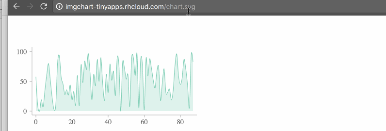

# IMG Charts

IMG Charts is an app/service/thingy that returns cool-looking SVG charts thru URL.

No dependencies, create and view charts through your **browser URL** or inject them
to the page through **&lt;img src=...&gt;** tag.





Behind the scenes, IMG Charts is a service that returns SVG generated by
[MetricsGraphics.js](http://metricsgraphicsjs.org/) on the server using node.js and is currently
deployed on a small gear in [Openshift](https://openshift.redhat.com).

### Usage

Construct a URL that contains (all, but _base URL_ parameters are optional):
- **base URL**: http://imgchart-tinyapps.rhcloud.com/chart.svg
- **type** of chart (line, point, ~~bar~~) followed by the data, eg: line=1,2,3,4
- for multiple series (eg: multiple lines) feel free to append "suffix" to the **type**, eg: line-profit=100,200&line23=1,2,3,4
- **color**, eg: color=red
- **legend**, eg: legend=profit
- **width** (in px), eg: width=400
- **height** (in px), eg: height=200
- **baselines**: TBD, eg: baselines=[20,'average],[30,'excellent']
- **markers**: TBD, eg: markers=[2,'Markets crashed'],[4,'FED announcement']
- separate all parameters with **&** (this is URL at the end of the day)

For instance:


```html
http://imgchart-tinyapps.rhcloud.com/chart.svg?line=10,40,70,10,5,60&color=green&legend=profit&width=800&height=200&baselines=[20,'average'],[80,'excellent']&markers=[2,'Markets crashed'],[4,'FED announcement']
```
Should result in:


### Examples

Docs don't exist (yet), learn by example.

#### Default chart
By default, the service will draw line chart with random data

http://imgchart-tinyapps.rhcloud.com/chart.svg
or
```html

```


#### Custom width
<http://imgchart-tinyapps.rhcloud.com/chart.svg?width=800>
or
```html

```


#### Line chart with random data

http://imgchart-tinyapps.rhcloud.com/chart.svg?line
or
```html

```


#### Scatterplot chart with random data

http://imgchart-tinyapps.rhcloud.com/chart.svg?points
or
```html

```


#### Line chart with predefined data
http://imgchart-tinyapps.rhcloud.com/chart.svg?line=1,5,20,5
or
```html

```


#### Multiple lines with predefined data
http://imgchart-tinyapps.rhcloud.com/chart.svg?line1=1,5,20,5&line2=10,30,10,20
or
```html

```


#### Multiple lines with predefined color and legend (random data)
http://imgchart-tinyapps.rhcloud.com/chart.svg?line1=&line2=&color1=salmon&color2=teal&legend1=revenue&legend2=expenses
or
```html

```


#### Custom x-values
<http://imgchart-tinyapps.rhcloud.com/chart.svg?line=[2010,10],[2013,50],[2016,40]>
or
```html

```


#### Markers
<http://imgchart-tinyapps.rhcloud.com/chart.svg?line=1,5,20,5&markers=[1,'before X'],[2,'after X']>
or
```html

```


#### Baselines
<http://imgchart-tinyapps.rhcloud.com/chart.svg?line=1,5,20,5&baselines=[10,'target']>
or
```html

```


